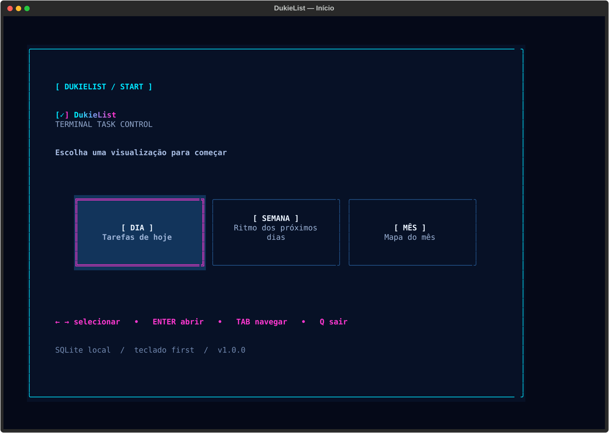
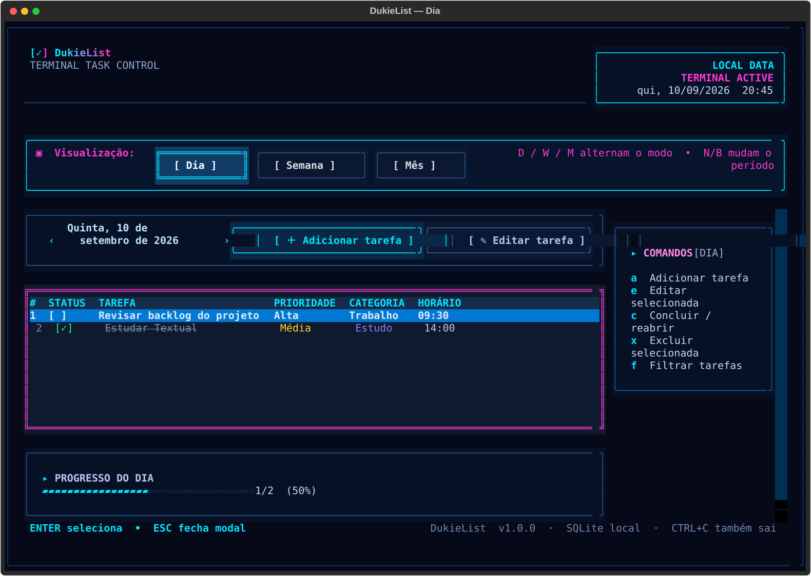
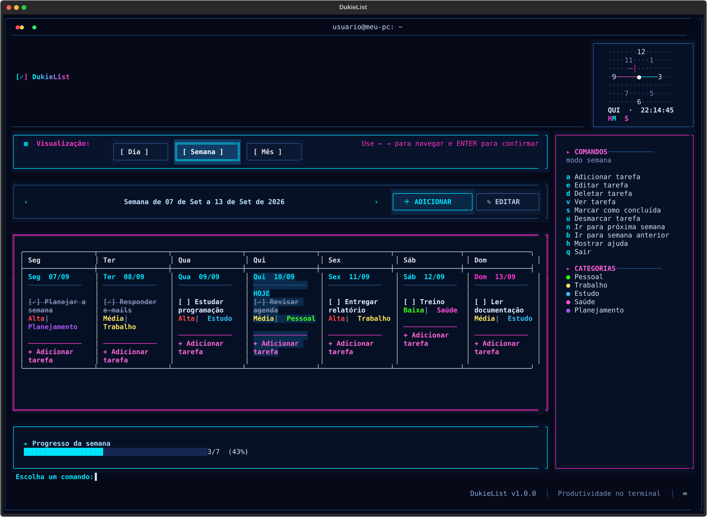
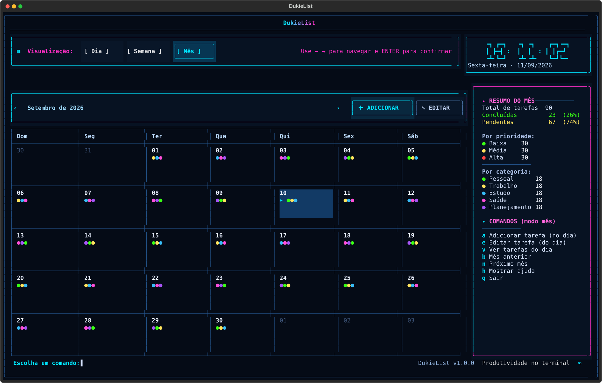
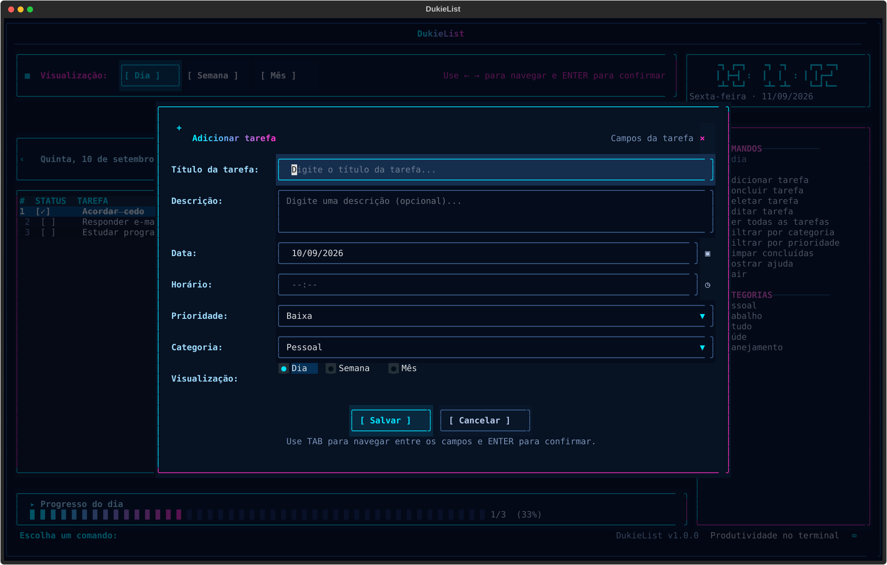

# DukieList

O DukieList é uma todo list TUI (Terminal User Interface) para organizar tarefas do dia a dia diretamente no terminal. A interface foi feita em Python com Textual, usa uma estética cyberpunk discreta e guarda tudo em um banco SQLite local.

## Screenshots

As imagens abaixo foram geradas a partir da aplicação em um terminal de 128×44 colunas usando dados de demonstração.

### Tela inicial — escolha do modo



### Visão diária



### Visão semanal



### Visão mensal



### Modal de adicionar tarefa



## O que pode ser feito

- Escolher Dia, Semana ou Mês na abertura e trocar de modo a qualquer momento.
- Criar tarefas com título, descrição, data, horário opcional, prioridade, categoria, status e modo de visualização após salvar.
- Editar qualquer tarefa selecionada e alterar todos os seus campos.
- Concluir e reabrir tarefas.
- Excluir tarefas com confirmação.
- Filtrar por texto, categoria, prioridade e status; usar `F` novamente para trocar ou limpar os filtros.
- Navegar para o dia, a semana ou o mês anterior e seguinte.
- Consultar percentual de conclusão, total, pendentes e distribuição por categoria.
- Usar o calendário mensal para selecionar um dia e ver as tarefas daquele dia.
- Continuar vendo os dados após fechar e abrir o aplicativo: o SQLite é carregado automaticamente.

## Atalhos

| Tecla | Ação |
| --- | --- |
| `D` | Modo Dia |
| `W` | Modo Semana |
| `M` | Modo Mês |
| `A` | Adicionar tarefa |
| `E` | Editar tarefa selecionada |
| `C` | Concluir ou reabrir tarefa |
| `X` | Excluir tarefa com confirmação |
| `F` | Abrir filtros |
| `N` / `B` | Próximo / período anterior |
| `↑ ↓ ← →` | Mover seleção; no calendário, mover o dia |
| `TAB` / `SHIFT+TAB` | Avançar ou voltar o foco entre controles |
| `ENTER` | Selecionar, abrir ou confirmar |
| `ESC` | Fechar modal |
| `H` / `?` | Mostrar ajuda completa |
| `Q` | Sair |

Nos formulários, `CTRL+S` salva diretamente. Pressionar `ENTER` em um campo de texto também envia o formulário.

## Requisitos no Ubuntu

- Ubuntu 22.04 ou mais recente.
- Python 3.11 ou mais recente.
- `python3-venv` e `python3-pip`.
- Um terminal com suporte a UTF-8 e cores ANSI/TrueColor.

Instale os pacotes básicos:

```bash
sudo apt update
sudo apt install -y python3 python3-venv python3-pip
```

## Instalação a partir da pasta baixada

Se o projeto estiver em `/home/leandro-dukievicz/Projetos/dukielist`:

```bash
cd /home/leandro-dukievicz/Projetos/dukielist
chmod +x scripts/install.sh
./scripts/install.sh
```

O instalador cria o ambiente virtual `.venv`, instala o pacote em modo editável, cria o comando `dukielist` em `~/.local/bin` e cria o atalho `DukieList.desktop` na Área de Trabalho.

Se `dukielist` não for encontrado no terminal atual, abra um novo terminal ou rode:

```bash
export PATH="$HOME/.local/bin:$PATH"
```

Para instalar manualmente, sem o script:

```bash
cd /home/leandro-dukievicz/Projetos/dukielist
python3 -m venv .venv
source .venv/bin/activate
python -m pip install -e .
```

## Como executar

Depois da instalação, o comando global é:

```bash
dukielist
```

Ou, sem depender do `PATH`:

```bash
/home/leandro-dukievicz/Projetos/dukielist/.venv/bin/dukielist
```

Também é possível executar como módulo ou passando um SQLite alternativo:

```bash
python -m dukielist
dukielist --db /caminho/para/meu-dukielist.db
```

Para fechar o programa, pressione `Q` ou `CTRL+C`.

## Dados e backup

Por padrão, as tarefas ficam em:

```text
~/.local/share/dukielist/dukielist.db
```

Esse arquivo é o backup completo. Para fazer uma cópia:

```bash
cp ~/.local/share/dukielist/dukielist.db ~/dukielist-backup.db
```

Para abrir uma cópia específica:

```bash
dukielist --db ~/dukielist-backup.db
```

## Estrutura do projeto

```text
dukielist/
├── dukielist/
│   ├── __init__.py       # versão do pacote
│   ├── __main__.py       # execução com python -m dukielist
│   ├── app.py            # ciclo de vida do Textual
│   ├── models.py         # Task, enums e parsing de data/hora
│   ├── services.py       # regras de negócio, filtros e progresso
│   ├── screens.py        # tela inicial, workspace e modais
│   ├── storage.py        # schema e CRUD SQLite
│   ├── widgets.py        # tabela, calendário, resumo e branding
│   └── theme.tcss        # tema cyberpunk e layout responsivo
├── docs/screenshots/     # screenshots documentados acima
├── tests/test_core.py    # testes do CRUD e períodos
├── scripts/install.sh    # instalação e atalhos locais
├── main.py               # entry point alternativo
├── pyproject.toml        # empacotamento e comando dukielist
├── requirements.txt      # dependência direta
└── .gitignore
```

## Desenvolvimento e testes rápidos

Verificar sintaxe:

```bash
cd /home/leandro-dukievicz/Projetos/dukielist
.venv/bin/python -m compileall -q dukielist
.venv/bin/python -m unittest discover -s tests -v
```

O projeto não precisa de servidor, conta externa ou conexão com a internet depois que a dependência é instalada.
