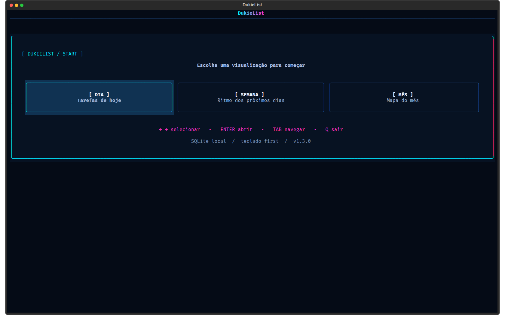
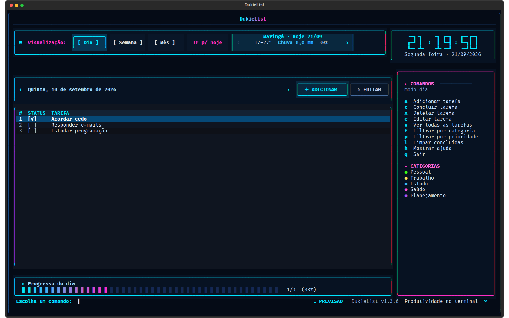
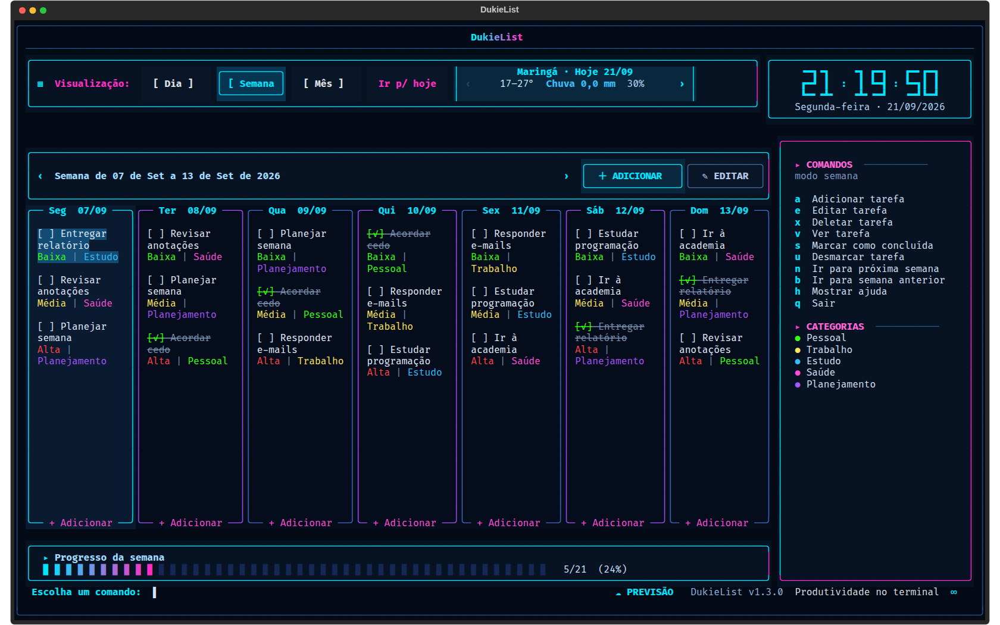
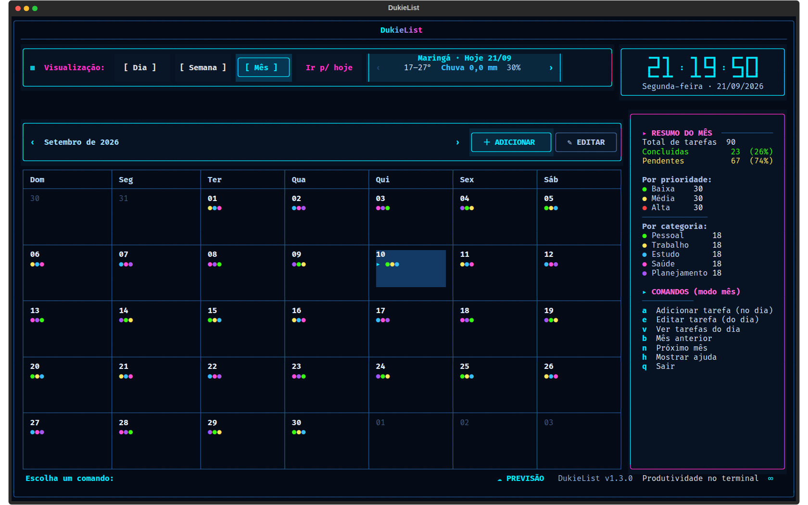
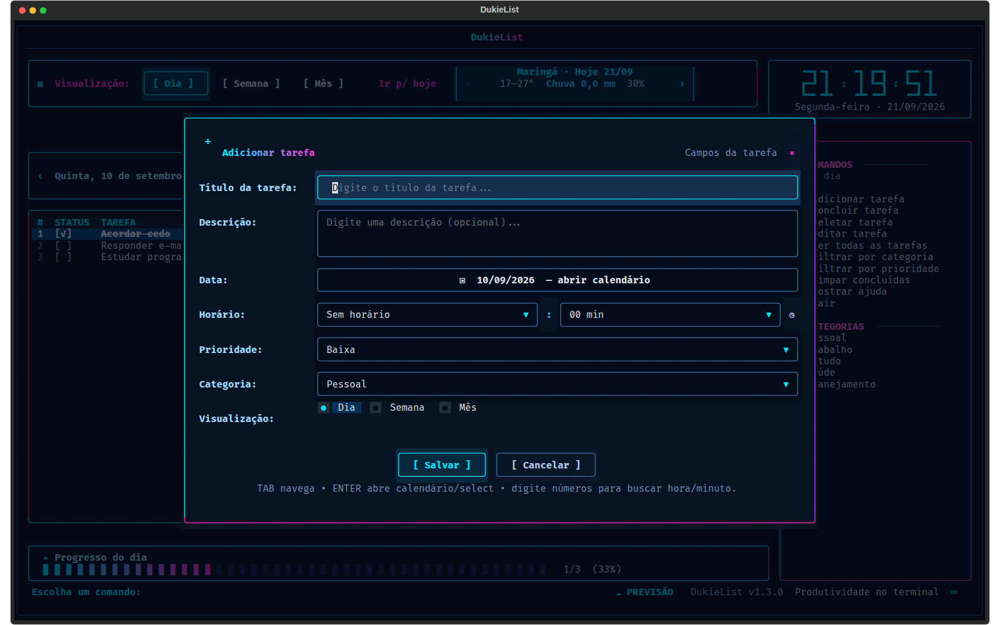
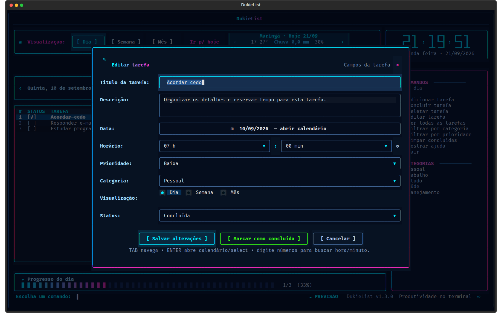

# DukieList

O DukieList é uma todo list TUI (Terminal User Interface) para organizar tarefas do dia a dia diretamente no terminal. A interface foi feita em Python com Textual, usa uma estética cyberpunk discreta e guarda tudo em um banco SQLite local.

Versão atual: **1.3.0**.

## Screenshots

As imagens abaixo foram geradas a partir da aplicação em um terminal de 168 colunas × 52 linhas usando dados de demonstração, seguindo a composição visual das referências.

### Tela inicial — escolha do modo



### Visão diária



### Visão semanal



### Visão mensal



### Modal de adicionar tarefa



### Modal de editar tarefa



## O que pode ser feito

- Escolher Dia, Semana ou Mês na abertura e trocar de modo a qualquer momento.
- Criar tarefas com título, descrição, data, horário opcional, prioridade, categoria, status e modo de visualização após salvar.
- Escolher datas em um calendário completo e definir hora/minuto em seletores próprios para teclado.
- Editar qualquer tarefa selecionada e alterar todos os seus campos.
- Concluir e reabrir tarefas.
- Excluir tarefas com confirmação.
- Filtrar por texto, categoria, prioridade e status; usar `V` para limpar filtros e ver todas as tarefas.
- Navegar para o dia, a semana ou o mês anterior e seguinte.
- Consultar percentual de conclusão, total, pendentes e distribuição por categoria.
- Usar o calendário mensal para selecionar um dia e ver as tarefas daquele dia.
- Manter a semana inteira visível, com barra de rolagem nas colunas que excederem o espaço disponível.
- Ajustar o calendário à altura do terminal para que todos os dias do mês vigente permaneçam na tela.
- Continuar vendo os dados após fechar e abrir o aplicativo: o SQLite é carregado automaticamente.
- Sincronizar cartões do Trello com prazo, sem duplicar tarefas em execuções futuras.
- Ver a previsão do tempo da localização aproximada atual no cabeçalho, com setas para hoje e mais três dias, incluindo chuva estimada em mm.

O topo exibe apenas o nome **DukieList** em degradê. Logo abaixo, as abas de visualização dividem a faixa com a previsão do tempo e um relógio **digital HH:MM:SS**, atualizado a cada segundo, com o dia da semana e a data. O relógio usa o horário local da máquina.

A composição segue as referências: marca em gradiente, abas, painéis com bordas ciano/magenta, sete colunas semanais, calendário com divisórias e indicadores coloridos, barra de progresso em gradiente e formulários com campos alinhados. A aparência final depende da fonte e do suporte a cores do terminal; efeitos gráficos de brilho e tipografia dos mockups não são reproduzidos pixel a pixel em uma TUI.

Para o layout completo, use cerca de **168×52** ou mais. Também há navegação testada em **140×44, 100×36 e 80×30**. Abaixo de 160 colunas, a previsão compacta é ocultada, mas continua acessível por `R` ou pelo botão no rodapé. Em telas estreitas, a lateral é recolhida (a ajuda continua em `H`), a semana acompanha o dia selecionado mostrando três ou uma coluna, e formulários/calendário usam rolagem. Em telas baixas, o relógio é compacto e o progresso é ocultado para preservar as tarefas. Redimensionar não modifica seus dados.

No modo Semana, `← →` escolhem o dia e `↑ ↓` percorrem todas as tarefas — inclusive as que não cabem de uma vez. `A` cria no dia selecionado; `ENTER` edita a tarefa ou abre a criação se o dia estiver vazio. No calendário, `ENTER` abre a lista do dia selecionado. Nas abas, use `TAB` para focar, `← →` para escolher e `ENTER` para confirmar.

## Atalhos

| Tecla | Ação |
| --- | --- |
| `D` | Modo Dia |
| `W` | Modo Semana |
| `M` | Modo Mês |
| `T` | Ir para a data de hoje em qualquer modo |
| `R` | Abrir a previsão do tempo |
| `A` | Adicionar tarefa |
| `E` | Editar tarefa selecionada |
| `C` | Concluir ou reabrir tarefa |
| `S` / `U` | Marcar como concluída / desmarcar |
| `X` / `DELETE` | Excluir tarefa com confirmação |
| `F` / `P` | Filtrar por categoria / prioridade |
| `L` | Limpar tarefas concluídas do período |
| `V` | Ver tarefas; limpa filtros ativos |
| `N` / `B` | Próximo período / período anterior, em todos os modos |
| `↑ ↓ ← →` | Mover seleção; no calendário, mover o dia |
| `TAB` / `SHIFT+TAB` | Avançar ou voltar o foco entre controles |
| `ENTER` | Selecionar, abrir ou confirmar |
| `ESC` | Fechar modal |
| `H` / `?` | Mostrar ajuda completa |
| `Q` | Sair |

Nos formulários, `CTRL+S` salva de qualquer campo; `S` também salva quando o foco não está em um campo de texto. Pressionar `ENTER` em um campo de texto também envia o formulário.

No campo **Data**, pressione `ENTER` para abrir o calendário. Use `← →` para mudar o dia,
`↑ ↓` para mudar a semana, `Page Up` / `Page Down` para trocar o mês, `T` ou `Home` para
voltar a hoje e `ENTER` para escolher. No horário, `TAB` alterna entre os seletores de hora e
minuto; `ENTER` abre a lista, as setas navegam e também é possível digitar, por exemplo, `14`
ou `35` para localizar diretamente. Selecione **Sem horário** no primeiro campo para removê-lo.

## Requisitos no Ubuntu

- Ubuntu 24.04 ou mais recente para os comandos de instalação abaixo (em versões anteriores, instale primeiro Python 3.11+).
- Python 3.11 ou mais recente.
- `python3-venv` e `python3-pip`.
- Um terminal com suporte a UTF-8 e cores ANSI/TrueColor.

## Baixar o projeto

Com Git instalado, clone o repositório e entre na pasta:

```bash
git clone https://github.com/LeandroDukievicz/dukielist.git
cd dukielist
```

Se você recebeu a pasta por ZIP ou já está trabalhando no diretório do projeto, pule esta seção.

Instale os pacotes básicos:

```bash
sudo apt update
sudo apt install -y git python3 python3-venv python3-pip
```

## Instalação a partir da pasta baixada

Dentro da pasta clonada:

```bash
cd dukielist  # omita se já estiver dentro da pasta clonada
chmod +x scripts/install.sh
./scripts/install.sh
```

O instalador cria o ambiente virtual `.venv`, instala o pacote em modo editável, cria o comando `dukielist` em `~/.local/bin` e cria o atalho `DukieList.desktop` na Área de Trabalho.

Se `dukielist` não for encontrado no terminal atual, abra um novo terminal ou rode:

```bash
export PATH="$HOME/.local/bin:$PATH"
```

Para instalar manualmente, sem o script:

```bash
cd dukielist  # omita se já estiver na pasta
python3 -m venv .venv
source .venv/bin/activate
python -m pip install -e .
```

## Como executar

Depois da instalação, o comando global é:

```bash
dukielist
```

Ou, a partir da pasta do projeto e sem depender do `PATH`:

```bash
./.venv/bin/dukielist
```

Também é possível executar como módulo ou passando um SQLite alternativo:

```bash
python -m dukielist
dukielist --db /caminho/para/meu-dukielist.db
```

Para fechar o programa, pressione `Q` ou `CTRL+C`.

## Previsão do tempo

Ao entrar na agenda, o DukieList detecta a **cidade aproximada pelo IP público** e carrega a
previsão no cabeçalho; enquanto o programa estiver aberto, atualiza a localização e a previsão
a cada 30 minutos. O IP público é enviado ao GeoJS para a detecção, mas não é salvo no banco
do DukieList. Por não usar GPS, a cidade pode estar errada
quando houver VPN, proxy ou imprecisão do provedor de internet.

As setas `‹` e `›` no cabeçalho percorrem **hoje e os três dias seguintes**. Cada dia mostra
temperatura mínima/máxima, chance de precipitação e **chuva estimada em milímetros** (chuva +
pancadas). `—` significa que a API não informou o valor; não é confundido com zero.

Pressione `R` ou selecione **☁ PREVISÃO** no rodapé para abrir os quatro dias de uma vez.
Nessa tela, **Minha localização** refaz a detecção, e **Buscar / atualizar** permite escolher
uma cidade manualmente (por exemplo, `Maringá, Paraná`). A escolha manual vale para a sessão
atual e é salva como alternativa caso a detecção automática falhe; na próxima abertura, o
aplicativo tenta detectar a localização atual novamente. Se não houver internet ou algum
serviço falhar, aparece um aviso, sem bloquear as tarefas locais.

A detecção por IP usa [GeoJS](https://www.geojs.io/docs/v1/endpoints/geo/) e a previsão usa
[Open-Meteo](https://open-meteo.com/en/docs). A API pública gratuita da Open-Meteo é destinada
ao uso **não comercial** e não exige chave. Para distribuir o DukieList como produto comercial,
é necessário contratar uma licença/API apropriada antes de usar esta integração.

## Sincronização com o Trello

O DukieList pode importar cartões atribuídos a você que estejam pendentes e tenham prazo a
partir do dia atual. As credenciais permanecem no arquivo externo e não são copiadas para o
banco da aplicação:

```bash
dukielist sync trello
```

Por padrão, o comando encontra `~/Projetos/codex-trello-env/.env`. Também é possível indicar
outro arquivo:

```bash
dukielist sync trello --env-file /caminho/para/.env
```

Para importar todos os cartões de um quadro, mesmo que não estejam atribuídos a você, use o
nome ou o ID. A opção pode ser repetida para combinar quadros:

```bash
dukielist sync trello --board "ESTUDOS"
dukielist sync trello --board "Compromissos" --board "Projetos"
```

Cartões sem prazo são ignorados, pois toda tarefa do DukieList precisa de uma data. Para uma
importação histórica ou que inclua cartões já concluídos:

```bash
dukielist sync trello --from-date 2024-01-01 --include-completed
```

O vínculo com o ID do cartão é salvo separadamente no SQLite. Assim, novas sincronizações
atualizam data, horário, título, descrição e conclusão sem criar duplicatas. A conclusão é
bidirecional: marcar ou reabrir uma tarefa na DukieList atualiza `dueComplete` no Trello, e a
mudança feita no Trello aparece na DukieList. Enquanto a aplicação estiver aberta, os estados
dos cartões vinculados são consultados automaticamente a cada minuto.

Se o Trello estiver temporariamente indisponível, a mudança local permanece salva em uma fila
persistente no SQLite e é reenviada na próxima tentativa ou ao executar `dukielist sync trello`.
A sincronização também é coordenada entre várias instâncias abertas da DukieList; um cartão
removido ou sem acesso não bloqueia os demais. A integração não move, arquiva nem exclui cartões.

## Dados e backup

Por padrão, as tarefas ficam em:

```text
~/.local/share/dukielist/dukielist.db
```

Esse arquivo contém tarefas, vínculos externos e preferências locais. Como o SQLite usa WAL,
faça a cópia pela API de backup do próprio SQLite, inclusive se a aplicação estiver aberta:

```bash
python3 - <<'PY'
import sqlite3
from pathlib import Path

source_path = Path.home() / ".local/share/dukielist/dukielist.db"
target_path = Path.home() / "dukielist-backup.db"
if not source_path.is_file() or target_path.exists():
    raise SystemExit("Verifique se o banco existe e se o destino ainda não existe.")
source = sqlite3.connect(source_path)
target = sqlite3.connect(target_path)
try:
    source.backup(target)
finally:
    source.close()
    target.close()
PY
```

Credenciais do Trello ficam fora desse banco e devem ser guardadas separadamente.

Para abrir uma cópia específica:

```bash
dukielist --db ~/dukielist-backup.db
```

## Estrutura do projeto

```text
dukielist/
├── dukielist/
│   ├── __init__.py       # versão do pacote
│   ├── __main__.py       # execução com python -m dukielist
│   ├── app.py            # ciclo de vida do Textual
│   ├── models.py         # Task, enums e parsing de data/hora
│   ├── pickers.py        # calendário de seleção de data
│   ├── services.py       # regras de negócio, filtros e progresso
│   ├── screens.py        # tela inicial, workspace e modais
│   ├── storage.py        # schema e CRUD SQLite
│   ├── trello.py         # integração e sincronização de cartões
│   ├── weather.py        # cliente e modelo da previsão do tempo
│   ├── weather_screens.py # modal da previsão do tempo
│   ├── widgets.py        # tabela, calendário, resumo, relógio e branding
│   └── theme.tcss        # tema cyberpunk e layout responsivo
├── docs/screenshots/     # screenshots documentados acima
├── tests/
│   ├── test_core.py      # CRUD, períodos e relógio digital
│   ├── test_storage.py   # fechamento de conexões e rollback SQLite
│   ├── test_trello.py    # sincronização e mapeamento de cartões
│   ├── test_ui.py        # navegação, formulários e geometria responsiva
│   └── test_weather.py   # previsão, chuva e preferência de cidade
├── scripts/
│   ├── install.sh        # instalação e atalhos locais
│   └── screenshots.py    # capturas reais com banco de demonstração temporário
├── main.py               # entry point alternativo
├── pyproject.toml        # empacotamento e comando dukielist
├── requirements.txt      # dependência direta
└── .gitignore
```

## Desenvolvimento e testes rápidos

Verificar sintaxe:

```bash
cd dukielist  # se ainda não estiver na pasta do projeto
.venv/bin/python -m compileall -q dukielist
.venv/bin/python -m unittest discover -s tests -v
```

Os testes usam bancos temporários e não acessam suas tarefas pessoais.

Para regenerar os prints reais (SVG):

```bash
env -u NO_COLOR .venv/bin/python scripts/screenshots.py
```

Para gerar também PNG, tenha Chrome ou Chromium instalado:

```bash
env -u NO_COLOR .venv/bin/python scripts/screenshots.py --png
```

A captura navega pelas seis telas e verifica que os modais foram abertos antes de exportar. Chrome/Chromium só é necessário para gerar os PNGs, nunca para usar o DukieList.

As tarefas funcionam localmente sem servidor ou conta externa. Previsão do tempo e sincronização
com o Trello dependem de internet; se estiverem indisponíveis, a agenda continua acessível.
